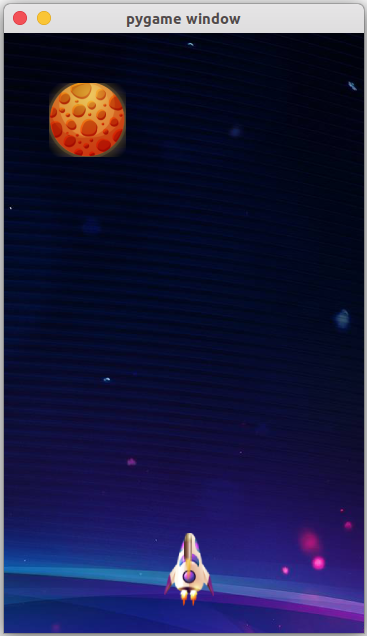

# Space Shooting Game In Python

*This is a **Space Shooting Game** using python module **pygame**. You can fire by pressing space key. There are 3 planets on my universe, LOL. If you destroy all of them you will be winner.*

## Installtion

``` bash
    Clone Repo - git clone https://github.com/chandan632/Space-Shooting.git
    Install pygame - pip install pygame
    Run game.py - python game.py
```

> ## Screenshot


